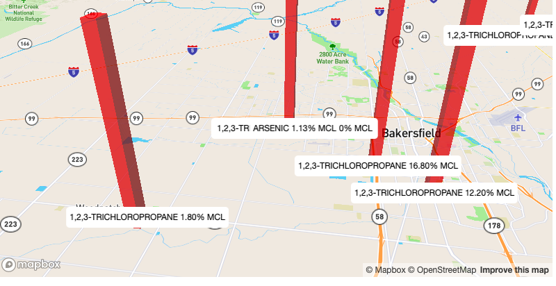

# Mapbox map with 3D columns Custom Element

## Example



## How to use

### Put the custom element HTML tag in you page:

```
  <cfa-oak-map-columns color="" center="" key=""></cfa-oak-map-columns>
```

The element takes 3 string attributes:

- color: color for the columns (defaults to red)
- center: lat,lon value
- key: your mapbox account key

### Include the javascript 

The javascript code for the custom element should be included in your client side package or referenced with a script tag:

```
<script type="module" src="index.js"></script>
```

The mapbox JS and CSS dependencies are not included in this web component so must also be included separately:

```
  <script src='https://api.mapbox.com/mapbox-gl-js/v1.2.0/mapbox-gl.js'></script>
  <link href='https://api.mapbox.com/mapbox-gl-js/v1.2.0/mapbox-gl.css' rel='stylesheet' />
```
